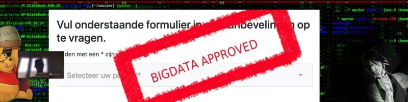

# Welcome

Welcome visitor :) You can take up contact with me if you want. You get reward for interesting information ;)
I also like to network btw, so don't hesitate to follow me on the twitter (or deviant art). Direct contact goes through wickr.

## About myself

Just some guy or girl like you (not going to tell which I am btw). I abhor corruption, extermism and radicalism. I like to connect people to each other if I know they are allright. I have a big network, so don't hesitate to give it a shot, perhaps I can help you. 

I am also a data engineer, a good one, however I don't like what happens with the data at my work. But somebody needs to do it and then it is better someone with respect for privacy and security. 

I am bit excentric. I like drawing, especially hentai. Oh well, I say hello to the fellow /d/egenerate, as you can see I am a man of culture. 

## Stuff I programmed

I did more, but not on this account ^_^

Simple document database on top of git and git-secret: [https://github.com/sariel44/database]
It also contains a simple task system. Got a pure CLI interface, I like that. 

Nice feature is that I can give others access to the information contained through their GPG key. 

Matrix like display program, just for fun and giggles. [https://github.com/sariel44/matrix-gadget]

## Foundations I like

If you want to do a good deed, shower them with money. They accept bitcoins ^_^ 

https://www.zoekhonden.com/

They train and use dogs to find people that are lost. Not a fun job, but it is neccesary. Lots of veterans among their ranks. 

## Contact

sariel44@protonmail.com
wickr:sariel44

## Links

* [https://www.redbubble.com/people/Sariels-bunker/shop]
* [https://twitter.com/sariel44]
* [https://github.com/sariel44/]
* [https://www.deviantart.com/sariel444]
